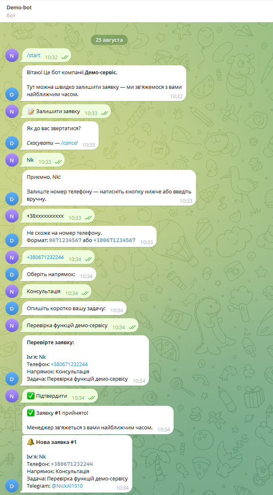
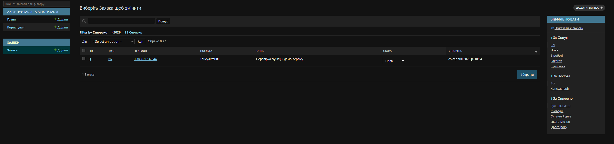

# Telegram Lead Bot

Collects customer requests through Telegram and stores them in a Django admin panel, so small businesses stop losing leads in DMs.

Built for businesses that currently take orders manually in Instagram or Telegram direct messages: the bot walks the customer through a short form, validates the input, notifies the owner instantly, and keeps everything searchable and exportable.

## Screenshots


| Bot conversation | Admin panel |
|---|---|
|  |  |

## Live demo

Try it: [@DemoTgLeadsbot](https://t.me/DemoTgLeadsbot)

## Features

- **Guided lead form** — name → phone → service → description → confirmation
- **Phone validation** with automatic normalization (`0671234567` → `+380671234567`)
- **One-tap phone sharing** via Telegram contact button
- **Cancel at any step** with `/cancel`, no dead ends
- **Instant admin notification** in Telegram when a lead arrives
- **Django admin panel**: list, search, filter by status and date, inline status editing
- **CSV export** with UTF-8 BOM so Excel does not break Cyrillic
- **Spam protection** — per-user daily submission limit

## Stack

Python 3.12 · Django 6.1 · aiogram 3.30 · SQLite

## Setup

```bash
git clone https://github.com/Nick-Alyshev/telegram-leads-bot.git
cd telegram-leads-bot

python -m venv .venv
source .venv/bin/activate        # Windows: .venv\Scripts\activate

pip install -r requirements.txt
cp .env.example .env             # then fill in BOT_TOKEN and ADMIN_CHAT_ID

python manage.py migrate
python manage.py createsuperuser
```

Get `BOT_TOKEN` from [@BotFather](https://t.me/BotFather), and your `ADMIN_CHAT_ID` from [@userinfobot](https://t.me/userinfobot).

## Running

Two processes, two terminals:

```bash
python manage.py runbot          # Telegram bot (long polling)
python manage.py runserver       # admin panel at http://127.0.0.1:8000/admin/
```

## Project structure

```
leadbot/
├── config/                      # Django settings, urls, wsgi
├── leads/
│   ├── models.py                # Lead model with status workflow
│   ├── admin.py                 # admin panel, filters, CSV export
│   └── management/commands/
│       └── runbot.py            # aiogram bot: FSM, handlers, validation
├── manage.py
└── requirements.txt
```

## Notes

Django's ORM is synchronous and aiogram is asynchronous, so all database calls are wrapped with `asgiref.sync.sync_to_async`. This keeps the bot responsive under concurrent conversations without introducing a separate async database layer.

Services offered by the bot are configured in `SERVICES` in `runbot.py`, and business details come from environment variables — adapting it to a new client takes minutes, not a rewrite.

## License

MIT
